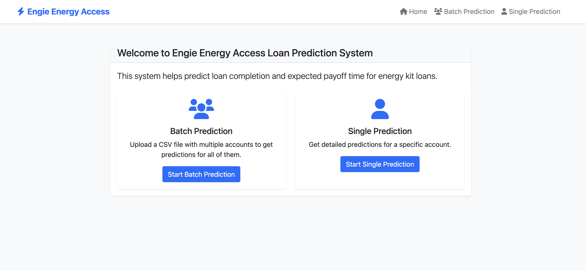
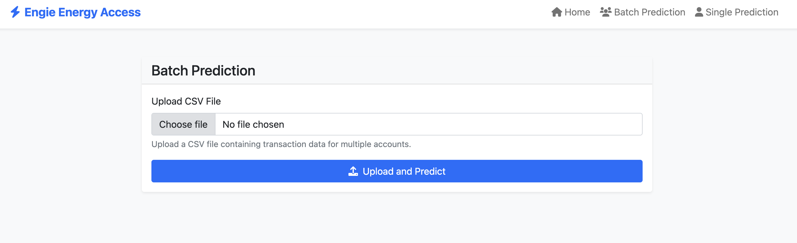
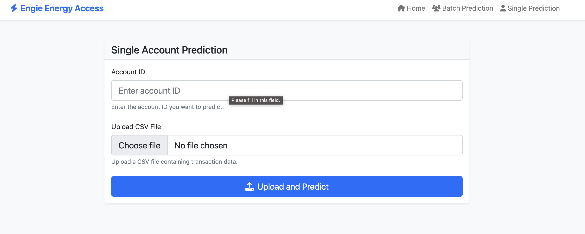
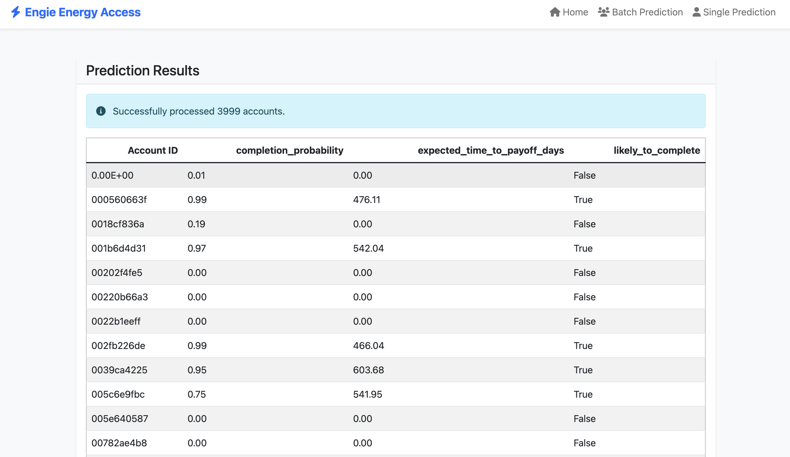

# Loan Completion Prediction System

## Overview
This project implements a machine learning system for predicting loan completion probabilities and expected time to payoff for loan accounts. The system analyzes transaction patterns and account characteristics to provide insights into loan performance.

## Features
- Predicts the probability of loan completion
- Estimates expected time to payoff for loans
- Handles batch and single-account predictions
- Provides a FastAPI web interface for easy interaction
- Supports CSV file uploads for batch processing
- Includes comprehensive feature engineering pipeline
- Real-time prediction capabilities
- Robust error handling and data validation
- Interactive visualization of predictions

## Requirements
- Python 3.8+
- pandas >= 1.2.0
- numpy >= 1.19.0
- scikit-learn >= 0.24.0
- FastAPI >= 0.68.0
- uvicorn >= 0.15.0
- joblib >= 1.0.0
- python-multipart >= 0.0.5
- pydantic >= 1.8.0

## Project Structure
```
.
├── src/
│   ├── app/
│   │   ├── static/      # Static files for web interface
│   │   │   ├── css/    # Custom styling
│   │   │   └── js/     # JavaScript files
│   │   └── templates/   # HTML templates
│   ├── features/        # Feature engineering code
│   │   ├── build_features.py
│   │   └── validation.py
│   ├── models/         # Model inference and prediction
│   │   ├── inference.py
│   │   └── training.py
│   └── config.py       # Configuration settings
├── models/             # Trained model files
│   ├── completion_model.joblib
│   └── timing_model.joblib
├── data/              # Data directory
│   ├── raw/          # Raw input data
│   └── processed/    # Processed features
├── tests/            # Unit and integration tests
├── requirements.txt  # Python dependencies
└── Makefile         # Build and run commands
```

## Detailed Installation Guide

### 1. Clone the Repository
```bash
git https://github.com/Solab5/Engie-datascience-Assessment.git
cd loan-completion-prediction
```

### 2. Environment Setup

#### Using venv (recommended)
```bash
# Create a virtual environment
python -m venv venv

# Activate the virtual environment
# On Windows:
venv\\Scripts\\activate
# On Unix or MacOS:
source venv/bin/activate

# Install dependencies
make install
```

#### Using conda
```bash
# Create a conda environment
conda create -n loan-prediction python=3.8
conda activate loan-prediction
make install
```

### 3. Configuration

2. Update the configuration variables in `src/config.py`:
```python
MODEL_DIR = "models/"
DATA_DIR = "data/"
LOG_LEVEL = "INFO"
```

### 4. Model Training
```bash
# Prepare the data directory
make setup

# Train the models
make train
```

## Technical Model Details

### Completion Model
- **Type**: Random Forest Classifier
- **Features**:
  - Transaction patterns (frequency, amounts, types)
  - Account characteristics
  - Payment behavior metrics
  - Temporal features

### Timing Model
- **Type**: Random Forest Regressor
- **Features**:
  - Payment frequency
  - Early payment indicators
  - Loan amount ratios
  - Historical payment patterns

### Feature Engineering Pipeline
1. **Transaction Processing**:
   - Date feature extraction
   - Payment pattern analysis
   - Transaction type aggregation

2. **Account-Level Features**:
   - Payment regularity scores
   - Early payment indicators
   - Loan utilization metrics

3. **Derived Features**:
   - Payment to loan ratios
   - Time-based patterns
   - Behavioral indicators

## API Documentation

### Batch Predictions

#### Request
```bash
curl -X POST "http://localhost:8000/predict/batch" \
  -H "Content-Type: multipart/form-data" \
  -F "file=@transactions.csv"
```

#### Example CSV Format
```csv
Account ID,Account Kit Type,Date of Transaction,Type of Transaction,Value of Transaction,...
ACC001,Standard,2023-01-01,Payment,100.00,...
```

#### Response
```json
{
  "predictions": [
    {
      "account_id": "ACC001",
      "completion_probability": 0.85,
      "expected_time_to_payoff_days": 120,
      "likely_to_complete": true
    }
  ]
}
```

### Single Account Prediction

#### Request
```bash
curl -X POST "http://localhost:8000/predict/single" \
  -H "Content-Type: application/json" \
  -d '{
    "account_id": "ACC001",
    "transactions": [
      {
        "date": "2023-01-01",
        "type": "Payment",
        "value": 100.00
      }
    ]
  }'
```

#### Response
```json
{
  "account_id": "ACC001",
  "completion_probability": 0.85,
  "expected_time_to_payoff_days": 120,
  "likely_to_complete": true
}
```

## Web Interface

### Dashboard

The main dashboard provides an overview of predictions and allows for both batch and single predictions.

### Batch Prediction Interface

Upload multiple transactions for batch processing.

### Single Prediction Interface

Input individual account details for immediate prediction.

### Results View

Detailed view of prediction results with visualizations.


